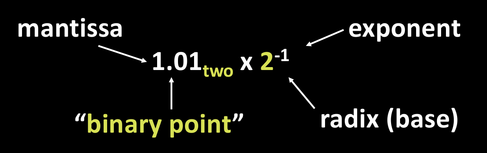
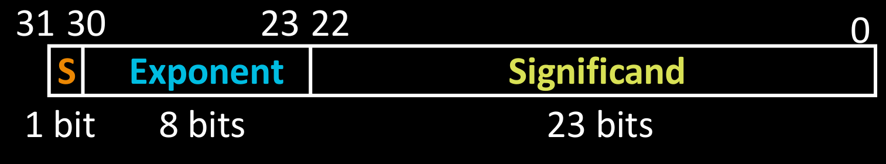
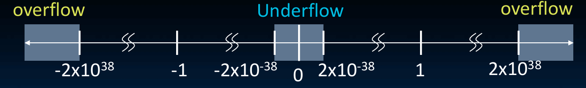

## 科学计数法

- mantissa : 尾数，表示有效数字部分。  
- exponent : 指数。  
- radix(base) : 基数，二进制中为2。  
  
浮点数之所以称为“浮点”，是因为小数点的位置可以根据指数的值而“浮动”。

## 浮点数表示

### 单精度浮点数

单精度浮点数使用32位二进制表示，其中1位用于符号，8位用于指数，23位用于尾数。  
- S: 符号位，0表示正数，1表示负数。
- E: 指数位，使用偏移量表示法（bias），偏移量为127。实际指数值为E - 127。
- M: 尾数位，表示有效数字部分。实际尾数值为1.M（隐含的1）。

**数值计算**  

$$
(-1)^S \times 1.M \times 2^{E-127}
$$

例如 1 *10000010* 10010100000000000000000
- 符号位S=1，表示负数。
- 指数位E=130，实际指数值为130 - 127 = 3。
- 尾数位M=10010100000000000000000，实际尾数值为1.100101。  
因此，数值为-1.100101 * 2^3 = -1100.101（十进制为-12.625）。

### 溢出与下溢

- 溢出（Overflow）：当计算结果超出浮点数表示范围时发生。例如，单精度浮点数的最大值约为$3.438 \times 10^{38}$，如果计算结果超过这个值，就会发生溢出。这是因为指数部分无法表示更大的数值了。
- 下溢（Underflow）：当计算结果接近于0但不等于0时发生。例如，单精度浮点数的最小正数约为$1.4 \times 10^{-45}$，如果计算结果小于这个值，就会发生下溢。这是因为指数部分无法表示更小的数值了。

## IEEE 754标准

| 情况 | 符号位 (S) | 指数位 (E) | 尾数位 (M) | 隐含整数位 | 数值公式 | 
|------|-----------|-----------|-----------|-----------|---------|
| **零** | 0 或 1 | 全 0 | 全 0 | — | $\pm 0$ |
| **非规格化数** | 0 或 1 | 全 0 | 非全 0 | 0 | $(-1)^S \times 0.M \times 2^{-126}$ |
| **规格化数** | 0 或 1 | 1 到 254 | 任意 | 1 | $(-1)^S \times 1.M \times 2^{E-127}$ |
| **无穷大** | 0 或 1 | 全 1 | 全 0 | — | $\pm \infty$ |
| **NaN** | 0 或 1 | 全 1 | 非全 0 | — | 未定义 |

### 非规格化数

***产生原因***：
最小的规格化数是$1.0 \times 2^{-126}$，第二小的规格化数是$1.0……1 \times 2^{-125}$，两者相差$2^{-149}$。最小的规格化数与0相差$2^{-126}$。两个间隔数值上差了$2^{23}$倍。为了填补0和最小规格化数之间的空白，IEEE 754引入了非规格化数。  
  
***表示方法***：
非规格化数的指数部分全为0，尾数部分非全为0。
非规格化数的数值计算公式为：
$$
(-1)^S \times 0.M \times 2^{-126}
$$
注意$ -126 \neq 0 - 127$，虽然非规格化数的指数部分全为0，表示的实际指数值为-126。
  
***结果***:

- 最小的非规格化数为$(-1)^S \times 0.00000000000000000000001 \times 2^{-126} = 1.4 \times 10^{-45}$ = (-1)^S \times 2^{-149}。
- 最大的非规格化数为$(-1)^S \times 0.11111111111111111111111 \times 2^{-126} = 1.18 \times 10^{-38}$。与最小的规格化数相差$2^{-149}$。空隙被均匀填上。

### Infinity和NaN

- Infinity（无穷大）：当指数部分全为1且尾数部分全为0时，表示正无穷大或负无穷大，取决于符号位。
- NaN（Not a Number）：当指数部分全为1且尾数部分非全为0时，表示未定义的数值，例如0除以0或负数的平方根等操作的结果。
- 这符合逻辑，超过无穷的数值应该是未定义的。

### 什么时候整数无法被精确表示？

- 任何整数都能被表示为有限位的二进制数。因此如果浮点数的尾数位足够多，就可以精确表示任何整数。
- 但是如果整数的二进制表示超过了尾数位的长度，就无法被精确表示了。例如，单精度浮点数的尾数位为23位，加上隐含的1，因此任何大于$2^{24}$的整数都无法被精确表示了。即$\pm 16777216$以上的整数无法被精确表示。

***示例***:

| 整数范围 | 二进制位数 | 最小间隔 | 能精确表示的整数 |
|---------|-----------|---------|---------------|
| $2^{24}$ 以内 | $\leq$ 24 位 | 1 | **所有整数** |
| $2^{24} \sim 2^{25}$ | 25 位 | 2 | 仅偶数 |
| $2^{25} \sim 2^{26}$ | 26 位 | 4 | 仅 4 的倍数 |
| $2^{26} \sim 2^{27}$ | 27 位 | 8 | 仅 8 的倍数 |

### 双精度浮点数

双精度浮点数使用64位二进制表示，其中1位用于符号，11位用于指数，52位用于尾数。
