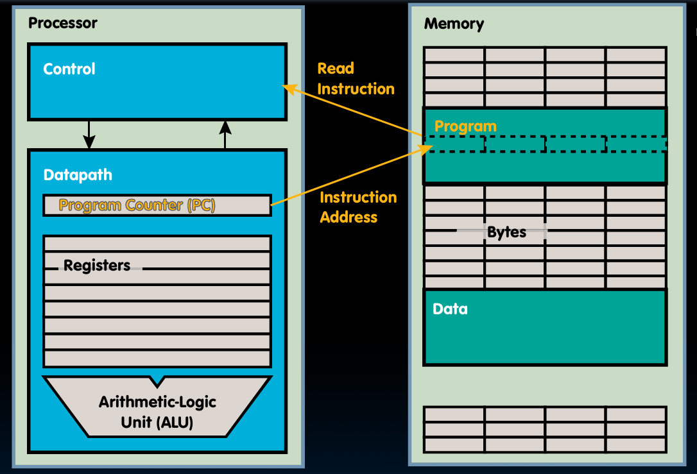

## ABI列表

在RISC-V架构中，虽然通用寄存器（x0-x31）在硬件层面都是一视同仁的普通寄存器，但软件约定（ABI，application binary interface）为它们分配了特定的用途。如果不遵守这些约定，程序就无法与操作系统或其他人的代码协作。

| 寄存器 | ABI名称 | 用途说明 | 谁保存？ |
| :--- | :--- | :--- | :--- |
| **x0** | `zero` | **硬连线为0** | - |
| **x1** | `ra`  | **返回地址**(return address) | Caller |
| **x2** | `sp`  | **栈指针**(stack pointer) | Callee |
| **x3** | `gp`  | **全局指针**(global pointer) | - |
| **x4** | `tp`  | **线程指针**(thread pointer) | - |
| **x5-x7** | `t0-t2` | **临时寄存器** (temporaries) | Caller |
| **x8** | `s0` / `fp` | **栈帧指针 / 保存寄存器** | **Callee** |
| **x9** | `s1`  | **保存寄存器**(saved) | **Callee** |
| **x10-x11** | `a0-a1`  | **参数/返回值**(arguments) | Caller |
| **x12-x17** | `a2-a7`  | **参数寄存器**(arguments) | Caller |
| **x18-x27** | `s2-s11`  | **保存寄存器**(saved) | **Callee** |
| **x28-x31** | `t3-t6`  | **临时寄存器**(temporaries) | Caller |

**说明**：

- `ra`:`jal` 指令默认把返回地址存到这里。函数末尾用 `ret`（`jalr x0, 0(x1)`）返回。
- `sp`:指向当前函数栈帧的顶部（通常是从高地址向低地址增长）。
- `gp`:用于快速访问静态/全局变量（优化寻址），ABI 固定用途 / 平台保留。
- `tp`:指向线程局部存储（TLS），多线程编程中用于存放每个线程独有的数据，ABI 固定用途 / 平台保留。
- `t0`-`t6`:函数调用时不保留，适合临时计算和传递参数。被调用者可以随意使用，无需恢复。
- `s0`/`fp`:通常 `s0` 作为 `fp` 指向栈帧底部。
- `s1`-`s11`:函数调用时必须保存，适合需要跨函数调用保持的变量。被调用者使用前要保存，返回前恢复。
- `a0`-`a1`:用于传递函数前两个参数和返回值。
- `a2`-`a7`:用于传递函数的第3到第8个参数。超过8个参数需要通过栈传递。
- `s2`-`s11`:函数调用时必须保存，适合需要跨函数调用保持的变量。被调用者使用前要保存，返回前恢复。
- `t3`-`t6`:和 `t0-t2` 一样，调用者不指望它们返回后还保留（Caller-saved）。适合临时计算和传递参数。

**概念解释**：

1. **Caller-saved (调用者保存)**：调用函数前，如果调用者（父函数）觉得这些寄存器里的数据以后还有用，就自己负责把它们存到栈上；调用返回后，再自己恢复。`ra`、`t0-t6`、`a0-a7` 都属于这一类。
2. **Callee-saved (被调用者保存)**：被调用的函数（子函数）如果想用这些寄存器，就要先保存它们原来的值（通常是压栈），在返回之前再恢复。`s0-s11` 都属于这一类。
3. **零寄存器**：`x0` 是硬件层面的特殊存在，不是软件约定。

## 分支指令

### beq/bne/blt/bge/bltu/bgeu

```assembly
beq rs1, rs2, L1
bne rs1, rs2, L1
blt rs1, rs2, L1
bge rs1, rs2, L1
bltu rs1, rs2, L1
bgeu rs1, rs2, L1
```

- beq：如果寄存器 `rs1` 和 `rs2` 的值相等，则跳转到标签 `L1` 处继续执行；否则继续执行下一条指令。
- bne：如果寄存器 `rs1` 和 `rs2` 的值不相等，则跳转到标签 `L1` 处继续执行；否则继续执行下一条指令。
- blt：如果寄存器 `rs1` 的值小于寄存器 `rs2` 的值，则跳转到标签 `L1` 处继续执行；否则继续执行下一条指令。
- bge：如果寄存器 `rs1` 的值大于等于寄存器 `rs2` 的值，则跳转到标签 `L1` 处继续执行；否则继续执行下一条指令。
- bltu：如果寄存器 `rs1` 的无符号值小于寄存器 `rs2` 的无符号值，则跳转到标签 `L1` 处继续执行；否则继续执行下一条指令。
- bgeu：如果寄存器 `rs1` 的无符号值大于等于寄存器 `rs2` 的无符号值，则跳转到标签 `L1` 处继续执行；否则继续执行下一条指令。

### if语句

**例子**:

```C
if (i == j)
{
    f = g + h;
}
```

对应的RISC-V汇编代码：  
设 i 在寄存器 `t0` 中，j 在寄存器 `t1` 中，f 在寄存器 `t2` 中，g 在寄存器 `t3` 中，h 在寄存器 `t4` 中

```assembly
bne t0, t1, L1  # 如果 i != j，跳转到 L1
add t2, t3, t4  # f = g + h
L1:
```

:::tip
注意到C语言中比较是相等，而RISC-V写的是不等。这实际上是符合逻辑的。
:::

### if-else语句

```C
if (i == j)
{
    f = g + h;
}
else
{
    f = g - h;
}
```

对应的RISC-V汇编代码：  
设 i 在寄存器 `t0` 中，j 在寄存器 `t1` 中，f 在寄存器 `t2` 中，g 在寄存器 `t3` 中，h 在寄存器 `t4` 中

```assembly
bne t0, t1, Else
add t2, t3, t4
j exit # j是无条件跳转指令，跳转到Exit
Else:
    sub t2, t3, t4
Exit:
```

### for语句

```C
int A[20];
int sum = 0;
for (int i = 0; i < 20; i++)
{
    sum += A[i];
}
```

对应的RISC-V汇编代码：
设 A 的基地址在寄存器 `t0` 中，sum 在寄存器 `t1` 中，i 在寄存器 `t2` 中

```assembly
add t1, x0, x0  # sum = 0
add t2, x0, x0  # i = 0
addi t3, x0, 20 # t3 = 20
Loop:
    bge t2, t3, Exit  # if i >= 20, exit loop
    lw t4, 0(t0)  # t4 = A[i]
    add t1, t1, t4  # sum += A[i]
    addi t0, t0, 4  # move to next element (assuming 4 bytes per int)
    addi t2, t2, 1  # i++
    j Loop           # 跳回 Loop
Exit:
```

## 逻辑运算

RISC-V提供了以下逻辑运算指令：

- `and rd, rs1, rs2`：按位与，`rd` = `rs1` & `rs2`
- `or rd, rs1, rs2`：按位或， `rd` = `rs1` | `rs2`
- `xor rd, rs1, rs2`：按位异或， `rd` = `rs1` ^ `rs2`
- `sll rd, rs1, rs2`：逻辑左移， `rd` = `rs1` << `rs2`
- `srl rd, rs1, rs2`：逻辑右移， `rd` = `rs1` >> `rs2`
- `slli rd, rs1, imm`：立即数逻辑左移， `rd` = `rs1` << `imm`
- `srli rd, rs1, imm`：立即数逻辑右移， `rd` = `rs1` >> `imm`
- `sra rd, rs1, rs2`：算术右移， `rd` = `rs1` >> `rs2`（保留符号位）
- `srai rd, rs1, imm`：立即数算术右移， `rd` = `rs1` >> `imm`（保留符号位）

:::tip
使用 xor 1111 1111取反
:::

## 伪指令

伪指令是汇编器提供的“快捷方式”，它并不是真正的CPU硬件指令，而是由一条或多条真实指令组合而成的“语法糖”。

| 伪指令 | 实际展开的真实指令 | 作用 |
| :--- | :--- | :--- |
| `nop` | `addi x0, x0, 0` | 空操作（什么都不做） |
| `li x1, 123` | `addi x1, x0, 123` | 加载立即数（Load Immediate） |
| `mv x1, x2` | `addi x1, x2, 0` | 寄存器间传送（Move） |
| `not x1, x2` | `xori x1, x2, -1` | 按位取反 |
| `neg x1, x2` | `sub x1, x0, x2` | 取负数 |
| `ret` | `jalr x0, 0(x1)` | 从函数返回 |

## 程序执行过程



- 程序编译产生的二进制机械码存储在内存中。
- CPU通过PC(program counter，程序计数器)指向下一条要执行的指令在内存中的地址。
- PC是一个在CPU内部的独立专用寄存器，不在`x0`-`x31`中。
- CPU读取指令，解码指令，执行指令。
- CPU修改PC的值，指向下一条要执行的指令地址(通常是当前指令地址 + 4，除非是跳转指令)。

## 函数调用

### 跳转指令

- `j L1`：无条件跳转到标签 `L1` 处继续执行。
- `jr rs1`：跳转到寄存器 `rs1` 中存储的地址处继续执行。
- `jal rd, L1`：将下一条指令的地址（返回地址）存储到寄存器 `rd` 中，然后无条件跳转到标签 `L1` 处继续执行。

```assembly
main:
    jal ra, func
    # func 执行完会回到这里
    li a0, 0
    ret

func:
    li a0, 1
    jalr x0, 0(ra)
```

### 寄存器说明

- `ra` (x1): 存储返回地址，调用函数时保存返回地址。
- `a0`-`a7` (x10-x17): 用于传递函数参数和返回值。
- `s0`-`s11` (x8-x9, x18-x27): 被调用函数需要保存的寄存器，调用者期望它们在函数返回后保持不变。

### 函数调用流程

1. 调用者准备参数。
2. 调用者使用指令跳转到被调用函数(jal)。
3. 在栈上分配空间给局部变量
4. 被调用函数执行其任务
5. 将返回值放在寄存器中，释放栈空间
6. 调用者从函数返回到调用点的下一条指令继续执行(ret)

### 栈与栈指针(sp)

- 栈是内存中的一块区域，用于存储函数调用时的局部变量、返回地址和保存寄存器等。
- `sp` (x2) 是栈指针，指向当前函数栈帧的顶部。栈通常从高地址向低地址增长。

### 函数调用示例

**被调用函数**:

```C
int Leaf(int g, int h, int i, int j)
{
    int f;
    f = (g + h) - (i + j);
    return f;
}
```

```assembly
Leaf:
    addi sp, sp, -8 # 为局部变量分配空间

    # 遵守ABI约定，使用前先保存s寄存器
    sw s0, 0(sp)  # 保存 s0 寄存器
    sw s1, 4(sp)  # 保存 s1 寄存器

    # 调用者传递参数 g, h, i, j 分别在 a0, a1, a2, a3 中
    add s0, a0, a1  # s0 = g + h
    add s1, a2, a3  # s1 = i + j
    sub a0, s0, s1  # a0 = s0 - s1 (返回值)

    lw s0, 0(sp)  # 恢复 s0 寄存器
    lw s1, 4(sp)  # 恢复 s1 寄存器
    addi sp, sp, 8 # 释放局部变量空间
    jr ra          # 返回调用者

```

**调用函数**:

```C
int sumSquare(int x, int y)
{
    return mult(x, x) + y;
}
```

```assembly
sumSquare:
    addi sp, sp, -8 # 为局部变量分配空间

    # 保存 s 寄存器
    sw s0, 0(sp)  # 保存 s0 寄存器
    sw s1, 4(sp)  # 保存 s1 寄存器

    # 调用 mult(x, x)
    mv a0, a0      # x 作为第一个参数
    mv a1, a0      # x 作为第二个参数
    jal ra, mult   # 调用 mult 函数，结果保存在 a0 中

    # 这里去了mult函数执行完后回到这里

    lw s0, 0(sp)  # 恢复 s0 寄存器
    lw s1, 4(sp)  # 恢复 s1 寄存器
    addi sp, sp, 8 # 释放局部变量空间
    jr ra          # 返回调用者
```
