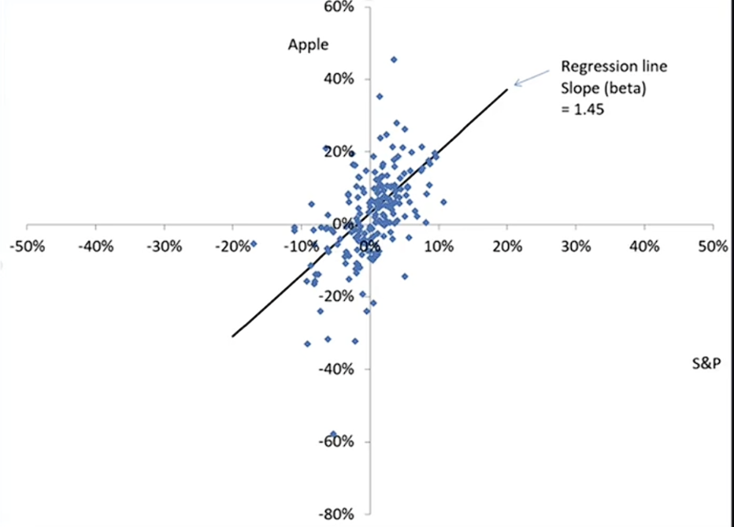

## 善与恶

- 科技是一把双刃剑，金融也是一种科技工具。
- 安德鲁·卡内基认为成功的年轻人不应将财富全部传给下一代，而是用于慈善事业。因为成功的是那些具有天然才能的人，他们有义务回馈社会。
- 这是一门关于如何在社会留下印记的课，而不是关于如何积累财富的课。

## 风险价值与压力测试

- VAR: 方差(Variance)或者风险价值(Value at Risk)，衡量在特定时间段内，投资组合可能遭受的最大损失。
- 压力测试(Stress Tests): 模拟极端市场条件下投资组合的表现，以评估其风险承受能力。

## 标普500指数

- 标普500指数是美国股市的一个重要指标，包含了500家大型公司的股票。
- 该指数被广泛用作衡量美国股市整体表现的基准

:::tip
    如果每支股票之间相互独立，根据大数定理，标普500指数应该波动较小。然而，标普500指数的波动性却很大，这表明股票之间存在相关性，尤其是在市场压力时期，股票价格往往会一起下跌。
:::

- 股票的$\beta$值衡量股票相对于市场的波动性。$\beta$值大于1表示股票比市场更波动，$\beta$值小于1表示股票比市场更稳定。例如图中散点图拟合直线斜率为1.45，说明Apple股票的$\beta$值为1.45，意味着Apple股票比标普500指数更波动。

## 分布与协方差

- 股票收益率的分布通常被假设为正态分布，但实际市场数据表明，股票收益率具有厚尾特征，即极端事件发生的概率比正态分布预测的要高。
- 正态分布公式:

$$
f(x) = \frac{1}{\sigma \sqrt{2\pi}} e^{-\frac{(x-\mu)^2}{2\sigma^2}}
$$

- 协方差(Covariance)衡量两只股票收益率之间的关系。正协方差表示两只股票收益率同向变动，负协方差表示两只股票收益率反向变动。
- 样本协方差公式:

$$
\text{Cov}(X,Y) = \frac{1}{n-1} \sum_{i=1}^{n} (X_i - \bar{X})(Y_i - \bar{Y})
$$

- 相关系数(Correlation Coefficient)是协方差的标准化版本，取值范围在-1到1之间，表示两只股票收益率之间的线性关系强度和方向。为了避免相关系数过高导致投资组合的风险，投资者通常会选择相关性较低的股票进行投资组合的构建。

## 保险

### 保险的定义与原理

- 保险是一种风险管理工具，通过支付一定的保费，转移潜在的损失风险给保险公司。
- 保险的基本原理是风险分散(Risk Pooling)，即通过将大量个体的风险集中在一起，保险公司能够更有效地管理和承担风险。
- 大数定律(Law of Large Numbers)是保险业的基础。个体的情况有很大不确定性，但当大量个体的风险被集中在一起时，整体的风险变得可预测，从而使保险公司能够设定合理的保费并提供保障。

### 保险市场中的问题

- 道德风险(Moral Hazard)是指当人们购买保险后，可能会因为有了保障而增加冒险行为，从而导致保险公司承担更大的风险。
- 逆向选择(Selection Bias)是指保险公司所承保或观察到的风险群体，不能代表理论上的总体风险分布。  
**逆选择**（Adverse Selection）是指在保险市场中，风险较高的个体更倾向于购买保险，而风险较低的个体则可能选择不购买保险，从而导致保险公司承担更多的风险。  
**核保选择**（Underwriting Selection）是指保险公司在承保过程中，通过筛选和评估申请人的风险状况，选择性地承保那些风险较低的个体，以降低整体风险水平。
